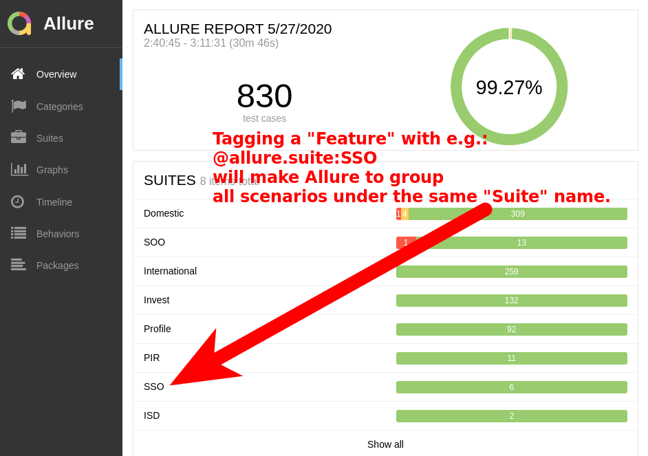
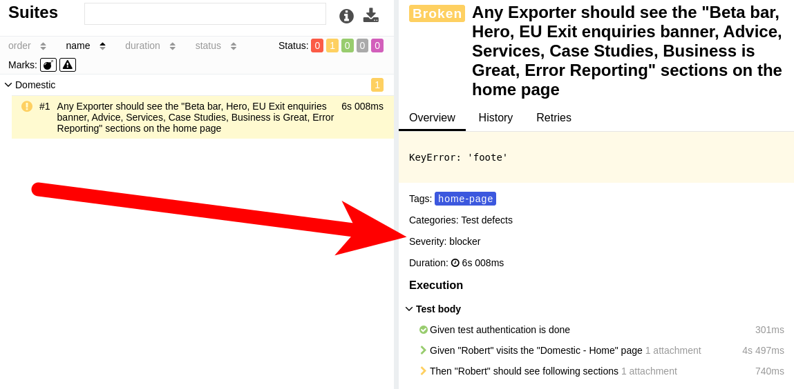
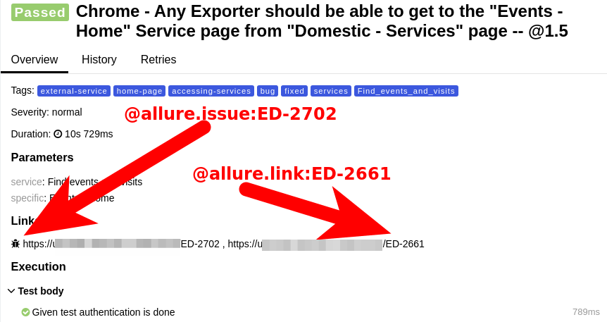

GREAT platform - Functional (Browser) Tests
-------------------------------------------

Functional (Browser) tests for [https://www.great.gov.uk](https://www.great.gov.uk).

This repository contains UI tests automated with:
* [Behave](https://behave.readthedocs.io/en/latest/) & [Selenium Python](https://selenium-python.readthedocs.io/)


**HISTORICAL NOTE**

Prior to mid Dec 2019 all Browser tests were executed in [BrowserStack](https://www.browserstack.com/).  
Later on it's been decided that we're going to run those tests in parallel in CircleCI using dockerised Chrome & Firefox.  
Thanks to this decision test execution times shrunk from roughly 2.5 hours to approx. 45 minutes in Dev and 21 minutes in Staging.  
Apart from that the tests became more stable.  
The only issue so far with this approach (as of May 2020) is that tests that require a sound playback won't work in Firefox.


##### Table of Contents  
* [Development](#Development)
    * [Different namespace](#Different-namespace)
    * [Requirements](#Requirements)
* [Running the tests](#Running the tests)
    * [Running browser tests in parallel in CircleCI](#Running-browser-tests-in-parallel-in-CircleCI)
    * [Run all scenarios in locally installed browser](#Run-all-scenarios-in-locally-installed-browser)
    * [Test environment specific scenarios](#Test-environment-specific-scenarios)
    * [How to run scenarios for a specific tag](#How-to-run-scenarios-for-a-specific-tag)
    * [How to run scenarios with behave command](#How-to-run-scenarios-with-behave-command)
* [Tagging](#Tagging)
    * [Suite](#Suite)
    * [Severity](#Severity)
    * [Links](#Links)
* [Tips](#Tips)
    * [Find all tags](#Find-all-tags)
    * [Discover unused step definitions](#Discover-unused-step-definitions)


## Development

### Different namespace

Browser (BDD) tests do not share the same namespace with other test suites from this repository.  
It's because `Functional (BDD)` tests also use `Behave` framework and sharing the same namespace would
mean that the step definitions would frequently overlap.
This in turn would lead to unintentional misuse of steps that are meant to be used in different contexts.

### Requirements

* python 3.8+
* pip
* dependencies listed in [requirements_browser.txt](../../requirements_browser.txt)
* [browser driver binaries](https://selenium-python.readthedocs.io/installation.html#drivers) installed in `$PATH`
* all required env vars exported (e.g. using [Convenience shell scripts](../../README.md#Convenience-shell-scripts))

## Running the tests

Before you start working with Behave and especially with tags,
it is highly recommended that you read introductory [tutorial](https://behave.readthedocs.io/en/latest/tutorial.html)
and two sections on tags:

* [Controlling Things With Tags](https://behave.readthedocs.io/en/latest/tutorial.html#controlling-things-with-tags)
* [Tag Expressions](https://behave.readthedocs.io/en/latest/tag_expressions.html)


### Running browser tests in parallel in CircleCI

[CircleCI CLI tool supports splitting tests across machines when running parallel jobs](https://circleci.com/docs/2.0/parallelism-faster-jobs/#using-the-circleci-cli-to-split-tests).  
Unfortunately this tool doesn't support Gherkin feature files.  
We've borrowed the concept of splitting the tests and implemented parallel browser test execution in a very simple way.  
The whole process consist of 3 steps:

1. Generate a list of all scenarios to run (take `BROWSER` and `TAGS` arguments into consideration) and save it in `scenario_titles.txt`
2. Split `scenario_titles.txt` into `N` equal chunks (where `N` is equal to the number of nodes [which is controlled by job's `parallelism` value])
3. Run scenarios (sequentially) from the Nth chunk of `scenario_titles.txt` on a node matching chunk number

Step *1* is done in [step_prepare_list_of_scenarios_to_run_by_parallel_browser_tests](../../.circleci/config.yml#128)).  
Whereas steps *2* & *3* are both done in [step_run_browser_tests_in_parallel](../../.circleci/config.yml#252)).


### Run all scenarios in locally installed browser

To run all scenarios in the default browser (Chrome) against DEV test environment:

1. Enable venv for browser tests (`workon` command is part of [virtualenvwrapper](https://pypi.org/project/virtualenvwrapper/) package)
    ```bash
    workon browser
    ```
2. Export env vars with `dir-dev.sh` convenience script
    ```bash
    # if you configured an alias then:
    dev
    # or source directly with:
    source ~/dir-dev.sh
    ```
3. Run all the tests
    ```bash
    make browser_tests_locally
    ```

*!!! IMPORTANT !!!*

Using `make browser_tests_locally` without extra parameters is HIGHLY not recommended as it will run all test scenarios
against the environment you're currently testing (e.g. DEV) and also those that are meant to work only in different test environment(s), like Staging or UAT.  
To avoid problems please use `TAGS` argument. It will help you to run only a subset of scenarios that are meant to work on environment you want to test.

### Test environment specific scenarios

There are multiple scenarios, in this test suite, which work only in a specific test environment e.g. DEV, Staging, UAT or Production.  
Most of the time this is because of:
* content differences between environments
* or the fact that Captcha is not in [test mode](https://developers.google.com/recaptcha/docs/faq#id-like-to-run-automated-tests-with-recaptcha.-what-should-i-do).

Such scenarios are annotated with following tags (click on any tag name to look for such scenarios in Github):
* [@dev-only](https://github.com/uktrade/directory-tests/search?q=dev-only+path%3Atests%2Fbrowser%2Ffeatures&unscoped_q=dev-only+path%3Atests%2Fbrowser%2Ffeatures) - works only in Dev
* [@stage-only](https://github.com/uktrade/directory-tests/search?q=stage-only+path%3Atests%2Fbrowser%2Ffeatures&unscoped_q=stage-only+path%3Atests%2Fbrowser%2Ffeatures) - works only in Staging
* [@uat-only](https://github.com/uktrade/directory-tests/search?q=uat-only+path%3Atests%2Fbrowser%2Ffeatures&unscoped_q=uat-only+path%3Atests%2Fbrowser%2Ffeatures) - works only in UAT
* [@prod-only](https://github.com/uktrade/directory-tests/search?q=prod-only+path%3Atests%2Fbrowser%2Ffeatures&unscoped_q=prod-only+path%3Atests%2Fbrowser%2Ffeatures) - works only in Production
* [@captcha](https://github.com/uktrade/directory-tests/search?q=captcha+path%3Atests%2Fbrowser%2Ffeatures&unscoped_q=captcha+path%3Atests%2Fbrowser%2Ffeatures) - require [Catpcha in test mode](https://developers.google.com/recaptcha/docs/faq#id-like-to-run-automated-tests-with-recaptcha.-what-should-i-do).
* [@skip-in-firefox](https://github.com/uktrade/directory-tests/search?q=skip-in-firefox+path%3Atests%2Fbrowser%2Ffeatures&unscoped_q=skip-in-firefox+path%3Atests%2Fbrowser%2Ffeatures) - doesn't work in Firefox


### How to run scenarios for a specific tag

To run a specific scenario or a set of scenarios tagged with the same tag (e.g. `@home-page`) use `TAGS` argument:  
```bash
TAGS="--tags=@home-page" \
    make browser_tests_locally
```

To run the same scenario(s) in Firefox simply add `BROWSER=firefox` to the command:
```bash
BROWSER=firefox TAGS="--tags=@home-page" \
    make browser_tests_locally
```

To run the same scenario(s) in headless Firefox simply add `HEADLESS=true` to the command:
```bash
HEADLESS=true BROWSER=firefox TAGS="--tags=@home-page" \
    make browser_tests_locally
```

To disable `AUTO_RETRY` feature (which will run failing scenario one more time) simply add `AUTO_RETRY=false`:
```bash
AUTO_RETRY=false HEADLESS=true BROWSER=firefox TAGS="--tags=@home-page" \
    make browser_tests_locally
```

To enable screenshot taking (disabled by default) add `TAKE_SCREENSHOTS=true`:
```bash
TAKE_SCREENSHOTS=true AUTO_RETRY=false HEADLESS=true BROWSER=firefox TAGS="--tags=@home-page" \
    make browser_tests_locally
```


### How to run scenarios with behave command

You can also run the same scenario(s) using `behave` command when in `./tests/browser` directory:

```bash
cd tests/browser
behave --tags=@home-page
```

All aforementioned arguments will also work:
* AUTO_RETRY=false
* BROWSER=firefox
* HEADLESS=true
* TAKE_SCREENSHOTS=true

So to run scenarios annotated with `@home-page` in headless Firefox and with auto-retry feature off use:
```bash
AUTO_RETRY=false BROWSER=firefox HEADLESS=true \
    behave \
        --tags=@home-page
```

Running a scenario in that way will generate a lot of output.  
Thus it's recommended to limit Behave's verbosity with some extra switches:

```bash
AUTO_RETRY=false BROWSER=firefox HEADLESS=true TAKE_SCREENSHOTS=true \
    behave \
        --format=pretty \
        --logging-filter=-root \
        --no-skipped \
        --no-timing \
        --tags=@home-page
```

To make Behave generate Allure result files, you'll need to enable `AllureFormatter` and specify an output folder with `--outfile`:

```bash
HEADLESS=true TAKE_SCREENSHOTS=true \
    behave \
        --format=allure_behave.formatter:AllureFormatter \
        --outfile=results/ \
        --format=pretty \
        --logging-filter=-root \
        --no-skipped \
        --no-timing \
        --tags=@home-page
```

It's also a good idea to skip scenarios which are not fully implemented or are failing because underlying issue is not fixed yet.
To skip a scenario or scenarios annotated with `@wip` tag, simply prepend a `~` sign before its name:

```bash
HEADLESS=true \
    behave \
        --no-skipped \
        --format pretty
        --tags=~@wip \
        --tags=@dev-only
```

Behave can also run a scenario or an particular scenario outline that is located at specific line in a feature file, e.g.
```bash
AUTO_RETRY=false BROWSER=chrome HEADLESS=true TAKE_SCREENSHOTS=true \
    behave \
        --no-skipped \
        --format pretty
        features/domestic/home_page.feature:10
```


## Tagging

Since mid Dec 2019 this test suite use [allure-behave](https://pypi.org/project/allure-behave/) to generate test results
which are then used to generate a test report using [Allure](https://github.com/allure-framework/allure2) reporting engine.

### Suite

Annotate `Features` with a `@allure.suite:{SUITE_NAME}` tag so that scenarios that belong to the same suite file are nicely grouped
in the `SUITES` section of an Allure report.

```gherkin
@allure.suite:SSO
Feature: SSO - Sign in
...
```

Here's an example report with test scenarios grouped by suite name:




### Severity

Annotate `Scenario` or `Scenario Outline` with one of the following tags to define
severity of an issue when this scenario fails:

* `@blocker`
* `@critical`
* `@normal`
* `@minor`
* `@trivial`

```gherkin
@blocker
Scenario: If this scenario fails, then it should block the release
...
```

As a result Allure will show the severity level in two places:




### Links

It's very useful to annotate all scenarios with links to corresponding ticket in a Project management tool and a Bug tracker.  

For example, annotating scenario with both links:

```gherkin
@allure.link:ED-2661
@allure.issue:ED-2702
Scenario: An example scenario with links to PM & Bug Tracking systems
...
```

Will result in seeing those links in Allure report:



You don't have specify the whole URL to either ticket in the tag, as Allure can substitute them automatically with link patterns.

These pattern can be defined upon report generation with these two arguments:
```bash
        --define AllureFormatter.issue_pattern=${BUG_TRACKER_URL_PATTERN} \
        --define AllureFormatter.link_pattern=${BUG_TRACKER_URL_PATTERN} \
```

For more details of this functionality please have a look at:

* ["Use user-data to pass link patterns to Allure-Behave"](https://github.com/allure-framework/allure-python/pull/464) PR.
* `step_run_browser_tests_in_parallel` step in [.circleci/config.yml](../../.circleci/config.yml)


## Tips

### Find all tags

To list all tags that scenarios are annotated with run:

```bash
cd tests/browser/features
grep "@" **/*.feature | cut -d":" -f2 | sed 's/ //g' | sort -u

@<business_type>
@<expected_service>
@<service>
@<social_media>
@<specific>
@<value>
@HPO
@UK_business
@accessibility
@accessing-services
@account-support
@advice
@allure.issue
@allure.link
@allure.suite
@anchor
@article
@articles
@breadcrumbs
...
```

### Discover unused step definitions

To discover unused steps we have to:

1 - Find out which steps are used in all feature files and replace parameter names with a generic "`VAR`":
```bash
grep -R --no-filename -i "given\|and\|when\|then" features/ |\
 grep -v "Scenario\|Examples\|Feature\||\|@\|#" |\
 sed "s/  //g" |\
 sed 's/"[^"]*"/"VAR"/g' |\
 sed "s/^Given //g" |\
 sed "s/^And //g" |\
 sed "s/^Then //g" |\
 sed "s/^When //g" |\
 sort -u
```

2 - List all steps known to `Behave` and replace parameter names with "`VAR`":

```bash
behave --steps-catalog |\
 grep -v "Trying base directory\|Using default path" |\
 sed 's/"[^"]*"/"VAR"/g' |\
 sed "s/^Given //g" |\
 sed "s/^And //g" |\
 sed "s/^Then //g" |\
 sed "s/^When //g" |\
 sort -u
```

Once we have both lists we can compare them with `diff` command to find unused steps:

```bash
diff -C0 <(grep -R --no-filename -i "given\|and\|when\|then" features/ |\
           grep -v "Scenario\|Examples\|Feature\||\|@\|#" |\
           sed "s/  //g" |\
           sed 's/"[^"]*"/"VAR"/g' |\
           sed "s/^Given //g" |\
           sed "s/^And //g" |\
           sed "s/^Then //g" |\
           sed "s/^When //g" |\
           sort -u) <(behave --steps-catalog |\
                      grep -v "Trying base directory\|Using default path" |\
                      sed 's/"[^"]*"/"VAR"/g' |\
                      sed "s/^Given //g" |\
                      sed "s/^And //g" |\
                      sed "s/^Then //g" |\
                      sed "s/^When //g" |\
                      sort -u) |\
          grep -e "^\+" |\
          sed "s/+ //g"
```
